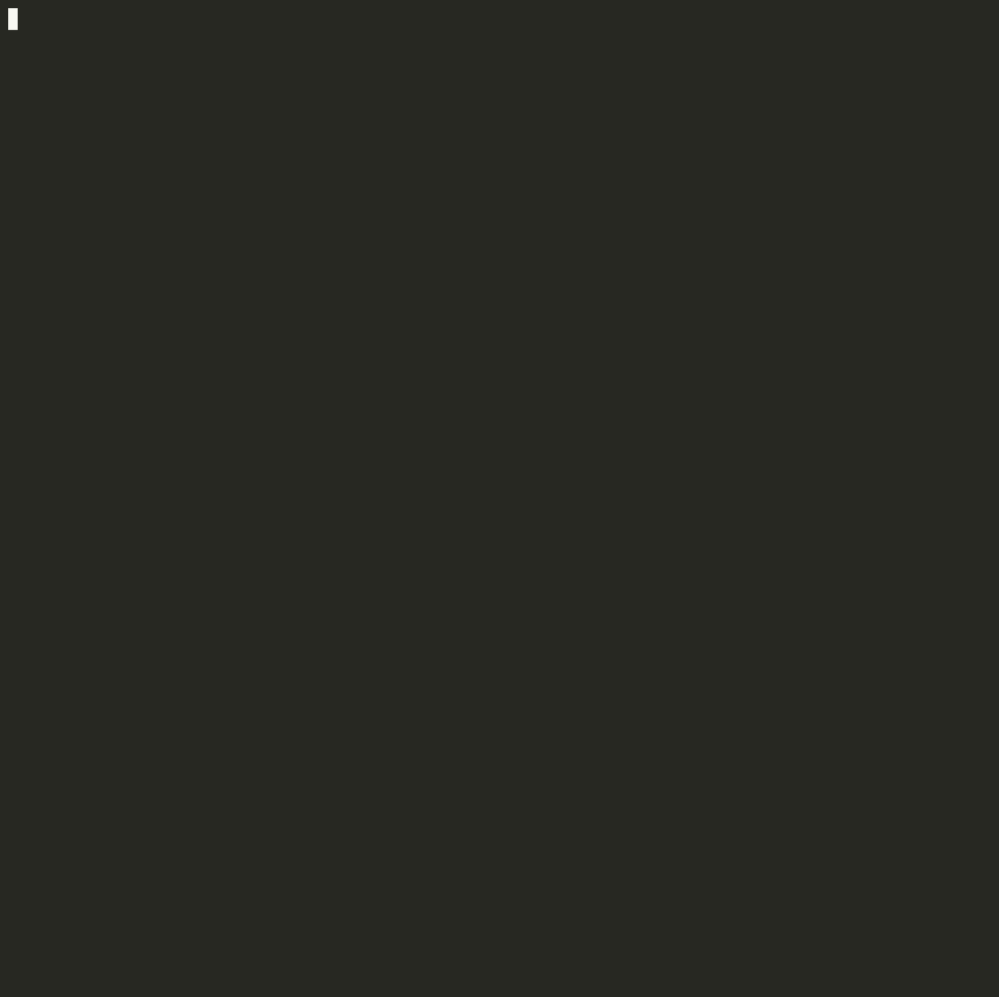

# cmdcap

Automated command capturer

## Summary

Uses a patched version of [asciicast2gif](https://github.com/asciinema/asciicast2gif) and [Expect](https://core.tcl-lang.org/expect/index) to automatically capture the output of commands in GIF and PNG format

## Usage

```sh
git clone https://github.com/hyperupcall/cmdcap
cd cmdcap
./bake init
./bake build

# To run the example
./bake prerun
./bake run
```

## Example

See the example in [`./example`](./example). Below are the results

### png


### gif


